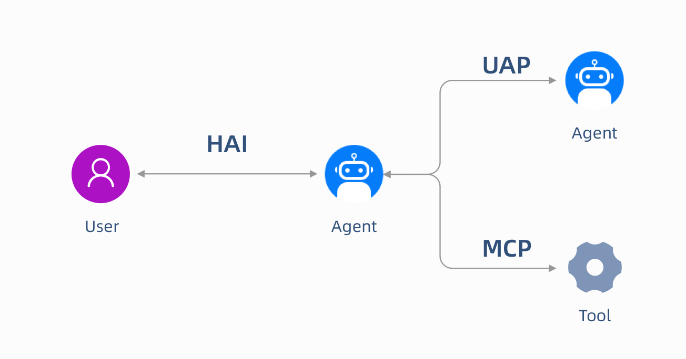

人与智能体交互协议

Human Agent Interaction Protocol

中兴通讯股份有限公司 发 布

目 次

[1 范围 1](#_Toc1593567963)

[2 术语和定义、符号、缩略语 1](#_Toc850119494)

[2.1 符号和缩略语 1](#_Toc13344)

[3 概述 2](#_Toc8245952)

[3.1 接口说明 2](#_Toc1977898740)

[3.2 接口定义 3](#_Toc491481930)

[3.2.1 事件类型规范 3](#_Toc1320445660)

[3.2.2 消息结构规范 4](#_Toc957703717)

[3.2.3 传输机制规范 4](#_Toc470745220)

[3.2.4 工作流程机制 4](#_Toc1345171137)

[3.2.5 与其他协议的关系 6](#_Toc1720997923)

[3.3 场景和模式 6](#_Toc1512072925)

[3.3.1 基础对话场景 6](#_Toc323638529)

[3.3.2 工具调用场景（Human-in-the-Loop） 9](#_Toc1400492252)

[3.3.3 断线重连场景 11](#_Toc729073510)

[4 用户接口开发指南 12](#_Toc1185023259)

[4.1 前端集成（基于HAI Client） 12](#_Toc43448214)

[4.2 后端集成 17](#_Toc1165260663)

[参考文献 30](#_Toc326938789)

HAI协议

1.  []{#_Toc1593567963 .anchor}范围

本标准描述了UI（用户界面）与 Agent（智能体）之间基于 HAI（Human Agent Interaction Protocol）的通讯接口设计指南，用于指导 UI 与 Agent 之间的交互协议设计、消息结构、事件处理及传输机制实现，确保两者之间高效、标准化的双向通信。

2.  []{#_Toc850119494 .anchor}术语和定义、符号、缩略语

    1.  []{#_Toc13344 .anchor}符号和缩略语

表1的符号和缩略语适用于本标准。

1.  符号和缩略语

  ------ ---------------- ---------------------------------- ----------------------------------------------------------------------------------------------------------------------------------------------------------------------------
   编号    缩略语或符号               全拼或名称                                                                                                 说明

    1           UI                  User Interface                                                                            客户端界面，接收用户输入并展示 Agent 消息

    2         Agent               Intelligent Agent                                                                              智能体，处理任务并通过事件与 UI 交互

    3          HAI         Human Agent Interaction Protocol                             智能体-用户交互协议是一种开放、轻量级且基于事件的标准化协议，旨在规范AI智能体（Agent）与前端应用程序之间的实时交互方式

    4         Gen UI                Generative UI             生成式UI(Generative UI) 是指UI界面元素是由Agent的输出动态生成或配置的UI组件。Agent在执行任务期间通知前端应用，如：状态、进度、输出和工具调用等，由前端生成某种UI元素并渲染

    5          HITL               Human in the Loop                                              人工参与流程，指的是在 AI Agent 执行过程中，引入人工的决策或反馈环节，以保证重要步骤的正确性或安全性

    6          SSE                Server-Sent Events                                                                            服务器向客户端单向推送实时事件流的协议

    7          JSON           JavaScript Object Notation                                                                                一种轻量级数据交换格式
  ------ ---------------- ---------------------------------- ----------------------------------------------------------------------------------------------------------------------------------------------------------------------------

3.  []{#_Toc8245952 .anchor}概述

    1.  []{#_Toc1977898740 .anchor}接口说明

HAI协议，全称Human Agent Interaction Protocol（人类智能体交互协议），是一个轻量级、事件驱动的开放协议。它充当了后端Agent和前端之间的桥梁，是Agent与用户相遇的地方。

HAI就像是一个"翻译官"，让不同的Agent都能用统一的"语言"与前端应用对话。无论你的Agent使用什么框架开发，通过HAI协议，它都能与用户界面实现流畅的实时交互。

{width="2.175in" height="2.3625in"}

图 1 HAI架构图

HAI 基于事件驱动架构，定义了一套统一的 JSON 事件类型与消息格式。通过标准事件流，前端与 Agent 可实现实时、可中断的协作式交互，降低多框架适配成本。

**核心技术点**

- **标准事件驱动**：统一采用结构化JSON事件格式。

- **流式推送**：支持 token-by-token 的流式推送。

- **前端工具编排**：Agent 执行时支持调用前端工具，全过程均可用标准事件表示。

- **状态共享**：Agent和UI之间共享状态，HAI提供了完整快照与增量更新事件更新。

- **多模态交互**：支持文本、图片、音频、视频等多模态数据格式。

- **协同可控**：支持人对Agent 始终保持控制，包括启动、状态查询、暂停、恢复和停止。

- **可信交互**：支持可视化Agent思考和输出过程，决策和结果可反馈可评价。

- **安全控制**：协议内建权限管理、身份认证等机制，适配企业级安全需求。

- **可扩展**：可基于基础事件类型进行自定义扩展，满足业务侧特定需求。

  1.  []{#_Toc491481930 .anchor}接口定义

      1.  []{#_Toc1320445660 .anchor}事件类型规范

HAI 协议采用事件流架构，事件作为 Agent 与前端通信的基本单元，用于表示 Agent 向前端的输出内容。它会将后端 Agent 的状态与动作转化为结构化 JSON 事件流，实时推送至前端。每个事件均带有清晰的 "身份标签"，以明确标识其具体用途。

核心事件类型如下：

- **生命周期事件（Lifecycle Events）**：表示 Agent 执行过程的开始、结束或出错。

  RUN_STARTED（任务开始）

  RUN_FINISHED（任务结束）

  RUN_ERROR（任务报错）、

  STEP_STARTED（某个步骤开始）

  STEP_FINISHED（某个步骤完成）

- **业务数据消息事件（Business Data Events）**：管理流式业务数据输出。

  BUSINESS_DATA_START（开始输出消息）

  BUSINESS_DATA_CONTENT（内容流）

  BUSINESS_DATA_END（消息结束）

- **Agent协同消息事件（Agent Collaborative Message Events）**：描述Agent 间分工、协同过程开始、结束。

  AGENT_COLLABORATIVE_MESSAGE_START（开始输出消息）

  AGENT_COLLABORATIVE_MESSAGE_CONTENT（内容流）

  AGENT_COLLABORATIVE_MESSAGE_END（消息结束）

- **工具调用事件（Tool Call Events）**：描述 Agent 调用工具的开始、参数、结束流程。

  TOOL_CALL_START（准备调用工具）

  TOOL_CALL_ARGS（调用工具的参数数据块）

  TOOL_CALL_END（调用工具结束）

  TOOL_CALL_RESULT（调用工具结果）

- **状态同步事件（State Events）**：前后端保持状态一致，适合对象同步、断线恢复等。

  STATE_SNAPSHOT（完整状态）

  STATE_DELTA（增量更新）

  MESSAGE_SNAPSHOT（提供对话中所有消息快照）

- **自定义与透传事件（Custom/Raw Events）**：支持自定义业务扩展。

  RAW（原始事件）

  CUSTOM（自定义事件）

  1.  []{#_Toc957703717 .anchor}消息结构规范

所有消息基于BaseMessage扩展，确保格式一致性和兼容性。消息是交互的核心数据载体，包含用户、Agent 或系统之间传递的完整内容，其唯一标识 id 会作为 messageId 字段在相关事件中出现，用于绑定事件与消息的关联关系。

interface BaseMessage {

id: string; // 消息唯一标识

role: \"user\" \| \"assistant\" \| \"system\" \| \"tool\" \| \"developer\"; // 发送者角色

content?: string; // 消息内容

name?: string; // 发送者名称（可选，如用户名、工具名）

timestamp?: number; // 消息时间

extra?: any // 额外参数

}

- **UserMessage(role: \"user\")**：用户消息，由用户通过 UI 发送，包含用户输入内容。

- **AssistantMessage(role: \"assistant\")**：助手消息，由 Agent 发送，包含响应内容或工具调用请求。

- **SystemMessage(role: \"system\")**：系统消息，提供 Agent 运行的上下文或指令，通常由系统预设。

- **ToolMessage(role: \"tool\")**：工具返回消息，包含工具调用结果，需与原工具调用关联。

- **DeveloperMessage(role: \"developer\")**：开发者消息，用于调试或内部监控，不展示给最终用户。

  1.  []{#_Toc470745220 .anchor}传输机制规范

HAI 提供了一个标准的 HTTP 客户端 HttpAgent，支持以下传输机制，具体实现方式由开发者根据实际场景选择。

**Server-Sent Events（SSE）**

**适用场景**：Agent 主导的单向流式更新（如 Agent 生成长文本、分步展示结果）。

**HTTP 二进制**

**适用场景**：适用于高性能、节省空间的定制传输。

2.  []{#_Toc1345171137 .anchor}工作流程机制

HAI 的核心工作流程如下图所示：

{width="4.397222222222222in" height="3.5430555555555556in"}

图 2 工作流程

工作流程基于事件驱动架构，以用户主动发起任务为例，主要包含以下步骤：

1.  **前端发送请求**

用户在前端界面（如聊天窗口）输入信息。

前端应用将用户输入封装为RunAgentInput类型的 JSON 请求，发送到后端的/awp端点。

2.  **后端处理请求**

    后端接收到请求后，解析RunAgentInput，提取threadId（会话 ID）、runId（任务 ID）和用户消息等关键信息。

    后端启动 AI Agent的处理流程，并准备通过事件流向前端发送处理状态和结果。

3.  **事件流通信**

后端通过 Server-Sent Events（SSE）协议，向前端持续发送事件流。

核心事件包括但不限于：

RUN_STARTED：表示Agent开始处理请求；

BUSINESS_DATA_CONTENT：Agent生成的文本内容（流式推送）；

TOOL_CALL_START：工具调用开始；

TOOL_CALL_ARGS：工具参数传递；

TOOL_CALL_END：工具调用结束；

RUN_FINISHED：Agent完成处理。

4.  **前端更新界面**

    前端接收到事件后，根据事件类型和内容，实时更新用户界面，动态展示Agent的处理过程（如流式文本生成、工具调用状态）和最终结果。

    1.  []{#_Toc1720997923 .anchor}与其他协议的关系

HAI、MCP 和 UAP 这三个协议共同工作，组成了一个完整的应用生态系统，帮助开发者更轻松地构建和管理系统。

- **MCP**：是面向模型与工具服务控制的内部通信协议，它提供标准接口封装底层服务逻辑，使得Agent能够以统一方式访问工具链资源，提升系统的模块化程度和可维护性。

- **UAP**：旨在解决多智能体系统（MAS）中存在的智能体⽆法⾃主发现、多协议并存导致的跨协议适配成本⾼昂以及上下⽂冗余传递等关键瓶颈问题。UAP 采⽤模块化拆分 + ⽣态化构建的核⼼⽅案，将多智能体协作能⼒拆解为 AI ⽹关、注册发现、⾝份认证等独⽴功能模块，提升了系统的灵活性与可维护性。

- HAI：这个协议连接了Agent和用户界面，让用户和Agent之间的互动变得更加简单和流畅，提升了使用体验。

  {width="5.768055555555556in" height="3.0256944444444445in"}

  1.  []{#_Toc1512072925 .anchor}场景和模式

      1.  []{#_Toc323638529 .anchor}基础对话场景

          使用业务数据事件（Business Data Events）, Agent 发送的一条消息以 BusinessDataStart 事件开始，接着是一个或多个 BusinessDataContent 事件（界面显示的业务数据内容），最后以 BusinessDataEnd 事件结束。

{width="5.03125in" height="4.979166666666667in"}

UI发送用户消息：

// 用户消息

{

\"id\":\"msg-1\",

\"role\":\"user\",

\"content\":\"介绍下HAI\"

}

// HttpAgent把参数封装为 RunAgentInput 类型并发送HTTP请求

{

\"threadId\": \"thread_12345\", // 当前会话ID，用于关联上下文

\"runId\": \"run_67890\", // 单次请求的唯一 ID，用于跟踪Agent任务状态

\"messages\": \[ // 存储完整的对话历史

{

\"id\": \"msg_1\",

\"role\": \"user\",

\"content\": \"介绍下HAI\"

}

\],

\"context\": \[\]\", // 可选，传递用户环境信息,

\"tools\": \[\], // 可选，声明本次请求中智能体可调用的工具列表

\"forwardedProps\": {} // 可选，附加属性

}

Agent文本消息响应流程：

// 文本消息开始

{

\"type\":\"BUSINESS_DATA_START\",

\"messageId\":\"msg-2\",

\"role\":\"assistant\",

\"timestamp\":1620000000500

}

// 增量内容推送（多次）

{

\"type\":\"BUSINESS_DATA_CONTENT\",

\"messageId\":\"msg-2\",

\"delta\":\"HAI是一套事件驱动的\",

\"timestamp\":1620000001000

}

{

\"type\":\"BUSINESS_DATA_CONTENT\",

\"messageId\":\"msg-2\",

\"delta\":\"Agent与前端交互协议，\",

\"timestamp\":1620000001500

}

{

\"type\":\"BUSINESS_DATA_CONTENT\",

\"messageId\":\"msg-2\",

\"delta\":\"支持实时流式交互。\",

\"timestamp\":1620000002000

}

// 文本消息结束

{

\"type\":\"BUSINESS_DATA_END\",

\"messageId\":\"msg-2\",

\"timestamp\":1620000002500

}

UI处理：

实时按messageId分组拼接delta，展示完整消息。

2.  []{#_Toc1400492252 .anchor}工具调用场景（Human-in-the-Loop）

HITL（Human-In-The-Loop，人工参与流程）指的是在 Agent 执行过程中，引入人工的决策或反馈环节，以保证重要步骤的正确性或安全性。我们并不希望 Agent 完全自主完成所有操作，而是在关键节点暂停，征求一下用户的意见或确认。

使用工具调用事件（Tool Call Events）可以实现 HITL（这里的工具是指纯前端操作的工具）,当 Agent 需要使用某个工具时，它会发出ToolCallStart 事件，随后会发出一个或多个 ToolCallArgs 将参数流式传输到工具的事件，最后以 ToolCallEnd 事件。

{width="3.482638888888889in" height="4.625694444444444in"}

UI定义用户确认的工具，并发送给 Agent：

// 前端定义用户确认的工具

const userConfirmationTool = {

name: \"confirmAction\",

description: \"Ask the user to confirm a specific action before proceeding\",

parameters: {

type: \"object\",

properties: {

action: {

type: \"string\",

description: \"The action that needs user confirmation\",

},

importance: {

type: \"string\",

enum: \[\"low\", \"medium\", \"high\", \"critical\"\],

description: \"The importance level of the action\",

},

},

required: \[\"action\"\],

},

}

// 把工具传递给 Agent

agent.runAgent({

tools: \[userConfirmationTool\],

// Other parameters\...

})

Agent启动工具调用：

// 工具调用开始

{

type: EventType.TOOL_CALL_START,

toolCallId: \"tool-123\", // 工具ID

toolCallName: \"confirmAction\", // 工具名称

parentMessageId: \"msg-456\" // 可选，关联的消息ID

}

// 流式输出调用工具的参数

{

type: EventType.TOOL_CALL_ARGS,

toolCallId: \"tool-123\",

delta: \'{\"action\":\' // Partial JSON being streamed

}\
\
{

type: EventType.TOOL_CALL_ARGS,

toolCallId: \"tool-123\",

delta: \'\"Deploy the application to production\"}\' // More JSON being streamed

}

// 标记工具调用完成，表示前端可以开始调用工具了

{

type: EventType.TOOL_CALL_END,

toolCallId: \"tool-123\"

}

UI处理：把工具参数接收完成后，执行该工具，也就是在界面显示确认框。等待用户操作后，把结果作为"工具消息"发送回 Agent。

{

id: \"result-789\",

role: \"tool\",

content: \"true\", // Tool result as a string

toolCallId: \"tool-123\" // References the original tool call

}

3.  []{#_Toc729073510 .anchor}断线重连场景

    当连接断开后，UI 触发重连。重连成功后，Agent 发送 MessagesSnapshot事件，包含提供当前对话中完整的消息历史记录。

    {width="3.1506944444444445in" height="5.565277777777778in"}

{

\"type\":\"MESSAGE_SNAPSHOT\",

\"messages\":\[

{\"id\":\"msg-1\",\"role\":\"user\",\"content\":\"Hello\"},

{\"id\":\"msg-2\",\"role\":\"assistant\",\"content\":\"Hi there! How can I help you?\"}

\],

\"timestamp\":1620000004500

}

4.  []{#_Toc1185023259 .anchor}用户接口开发指南

    1.  []{#_Toc43448214 .anchor}前端集成（基于HAI Client）

        前端可通过HAI Client SDK快速集成 HAI 能力，实现如下：

// task.component.ts

import { Component } from \'@angular/core\';

import { HttpAgent } from \'hai-client\';

import { AgentSubscriber } from \'hai-client/dist/client/agent/subscriber\';

import { PlxDialogue, PlxMessageRoleType } from \'paletx/ai/plx-chat\';

import { RestAPI } from \'../../shared/util/rest-api\';

\...\...

\@Component({

selector: \'task\',

templateUrl: \'task.component.html\',

styleUrls: \[\'./task.component.less\'\]

})

export class TaskComponent {

public dialogue: PlxDialogue;

\...\...

public async onSend(dialogue: PlxDialogue): Promise\<void\> {

// 初始化消息

const initialMessages = dialogue.messages;

// HAI发送POST请求的body参数

const requestParam = {

url: RestAPI.chatUrl,

initialMessages,

};

// 初始化HAI的POST请求

const agent = new HttpAgent(requestParam);

// 根据事件订阅消息

const subscriber: AgentSubscriber = {

onRunStartedEvent: (eventData) =\> {

// 开始事件，表示处理请求的第一个事件

console.log(\"RunStarted:\", eventData);

},

onStepStartedEvent: (eventData) =\> {

// Agent某个步骤开始事件

console.log(\"StepStarted:\", eventData);

},

onBusinessDataStartEvent: (eventData) =\> {

// 业务数据开始接收

console.log(\"Streaming start:\", eventData);

},

onBusinessDataContentEvent: (eventData) =\> {

// 业务数据接收中，该事件可能会触发多次，HAI会自动拼接事件内容

console.log(\"Streaming text:\", eventData);

// 根据接收的数据，处理业务逻辑

this.updateDialogueMessages(eventData, dialogueMessages);

},

onBusinessDataEndEvent: (eventData) =\> {

// 业务数据接收完成，最后返回完整的业务数据

console.log(\"Streaming end:\", eventData);

// 根据接收的数据，处理业务逻辑

this.updateDialogueMessages(eventData, dialogueMessages);

},

onAgentCollaborativeMessageStartEvent: (eventData) =\> {

// Agent协同消息开始

console.log(\"AgentCollaborativeMessageStart:\", eventData);

},

onAgentCollaborativeMessageContentEvent: (eventData) =\> {

// Agent协同消息内容，该事件可能会发送多次，HAI会自动拼接数据

console.log(\"AgentCollaborativeMessageContent:\", eventData);

},

onAgentCollaborativeMessageEndEvent: (eventData) =\> {

// Agent协同消息结束

console.log(\"AgentCollaborativeMessageEnd:\", eventData);

},

onToolCallStartEvent: (eventData) =\> {

// 工具调用开始，比如调用前端定义的工具

console.log(\"ToolCallStart:\", eventData);

},

onToolCallArgsEvent: (eventData) =\> {

// 工具调用参数，该事件可能会发送多次，HAI会自动拼接数据

console.log(\"ToolCallArgs:\", eventData);

},

onToolCallEndEvent: (eventData) =\> {

// 工具调用结束，表示参数接收完了，可以调用前端工具了

console.log(\"ToolCallEnd:\", eventData);

},

onStateDeltaEvent: (eventData) =\> {

// 状态同步，这个只会同步部分状态数据，通过JSON PATCH的方式更新指定对象数据

console.log(\"StateDelta:\", eventData);

},

onStepFinishedEvent: (eventData) =\> {

// Agent某个步骤调用结束

console.log(\"StepFinished:\", eventData);

},

onRunFinishedEvent: (eventData) =\> {

// Agent运行完成

console.log(\"RunFinished:\", eventData);

},

// 还可以订阅其他HAI事件

\...\...

}

// 订阅消息

const subscription = agent.subscribe(subscriber);

// HAI发送HTTP请求

const result = await agent.runAgent();

console.log(result);

}

private updateDialogueMessages(eventData: any, dialogueMessages: any\[\]): void {

const { agent, event, messages } = eventData;

const newAssistantMessage = messages\[messages.length - 1\];

const { id, role, content } = newAssistantMessage \|\| {};

const contents = this.parseJsonString(content);

let newDialogueMessage = dialogueMessages.find(message =\> message.id === id);

if (newDialogueMessage) {

newDialogueMessage.contents = contents;

} else {

newDialogueMessage = {

id,

role,

avatar: \'assets/img/avatar.png\',

name: \'智能体名称\',

contents,

timestamp: event.timestamp,

};

dialogueMessages.push(newDialogueMessage);

}

this.dialogue = {

\...this.dialogue,

messages: dialogueMessages,

};

}

private parseJsonString(jsonString: string): any\[\] {

if (!jsonString \|\| typeof jsonString !== \'string\') {

throw new Error(\'输入必须是有效的字符串\');

}

try {

// 处理原始字符串为合法JSON数组

const legalJsonArrayStr = \`\[\${jsonString.replace(/}{/g, \'},{\')}\]\`;

// 解析并返回数组

return JSON.parse(legalJsonArrayStr);

} catch (error) {

throw new Error(\`JSON解析失败: \${(error as Error).message}\`);

}

}

}

2.  []{#_Toc1165260663 .anchor}后端集成

    后端可通过编写简单的消息构造类，在Agent使用时通过调用构造类来达到快速发送标准时间流，示例如下：

    提供chat接口：

import json

import asyncio

from typing import Any

from fastapi import APIRouter, Request

from fastapi.responses import StreamingResponse

from app.utils.logger import logger

from app.agent.chat_agent import ChatAgent

async def translate_sse(agent, body):

try:

\# 根据agent类型传递不同的参数

response = agent.run(body)

for message in response:

sse_data = f\"data: {json.dumps(message, ensure_ascii=False)}\\n\\n\"

yield sse_data

except asyncio.CancelledError:

logger.info(\"SSE流被取消，客户端可能已断开连接\")

raise

except Exception as e:

logger.error(f\"SSE流处理过程中发生错误: {e}\")

raise

finally:

await asyncio.sleep(0.2)

\@router.post(\"/chat\")

def ai_app_chat(body: HAIAgentRequest):

chat_agent = ChatAgent()

return StreamingResponse(

translate_sse(chat_agent, body),

media_type=\"text/event-stream\"

)

实现Agent，并通过agent发送标准格式数据：

from app.agent.base import Agent

class ChatAgent(Agent):

agent_name = \"Agent\"

def \_\_init\_\_(self, agent_name: str = agent_name):

super().\_\_init\_\_(agent_name=agent_name)

async def run(self, body):

\# 解构body体

threadId = body.threadId

runId = body.runId

messages = body.messages

context = body.context

tools = body.tools

forwardedProps = body.forwardedProps

\# 发送任务开始数据

yield self.outputer.build_sse_data(

self.outputer.build_run_started(\"msgId-001\", role=\"assistant\")

)

\# 发送Agent协同数据

yield self.outputer.build_sse_data(

self.outputer.build_agent_collaborative_message_start(\"USER\", \"Agent\", \"msgId-001\", role=\"assistant\")

)

yield self.outputer.build_sse_data(

self.outputer.build_agent_collaborative_message_content(\"USER\", \"Agent\", \"msgId-001\", role=\"assistant\")

)

yield self.outputer.build_sse_data(

self.outputer.build_agent_collaborative_message_end(\"msgId-001\", role=\"assistant\")

)

\# 发送任务状态数据

yield self.outputer.build_sse_data(

self.outputer.build_state_delta(\"add\", \"/workflowItems/0/status\", \"running\", role=\"assistant\")

)

\# 发送任务状态修改数据

yield self.outputer.build_sse_data(

self.outputer.build_state_delta(\"replace\", \"/workflowItems/0/status\", \"done\", role=\"assistant\")

)

\# 发送任务步骤开始数据

yield self.outputer.build_sse_data(

self.outputer.build_step_started(\"智能处理\", role=\"assistant\")

)

\# 发送任务过程数据

yield self.outputer.build_sse_data(

self.outputer.build_business_data_start(\"msgId-001\", role=\"assistant\")

)

\# 调用LLM 实际业务内容，需要根据业务进行调整

messages = self.get_agent_messages()

response = self.llm.ask_stream(

messages=messages

)

\# 发送模型返回数据，如果需要根据业务发送不同业务，需要实现不同的业务逻辑处理

async for chunk in response:

chatInfo = self.outputer.build_text(chunk)

\# 发送任务开始数据

yield self.outputer.build_sse_data(

self.outputer.build_business_data_content(chatInfo, \"msgId-001\", role=\"assistant\")

)

\# 发送任务过程结束数据

yield self.outputer.build_sse_data(

self.outputer.build_business_data_end(\"msgId-001\", role=\"assistant\")

)

\# 发送任务步骤结束数据

yield self.outputer.build_sse_data(

self.outputer.build_step_finished(\"智能处理\", role=\"assistant\")

)

\# 发送任务结束数据

yield self.outputer.build_sse_data(

self.outputer.build_run_finished(\"msgId-001\", role=\"assistant\")

)

实现标准事件输出类：

from typing import Any

from pydantic import BaseModel

import json

class BaseChatOutput(BaseModel):

def \_\_init\_\_(self, \*\*default_fields):

super().\_\_init\_\_()

self.\_default_fields = default_fields

\@staticmethod

def build_sse_data(chat_info: Any or str) -\> str:

sse_data = \"\"

if isinstance(chat_info, str):

sse_data = f\"data: {chat_info}\\n\\n\"

else:

data = {k: v for k, v in chat_info.dict(exclude_none=True).items()}

sse_data = f\"data: {json.dumps(data, ensure_ascii=False)}\\n\\n\"

return sse_data

def build_run_started(self, message_id: str, role: str = \"assistant\", timestamp: int = None, \*\*kwargs) -\> dict:

\"\"\"

构造RUN_STARTED消息

\"\"\"

if timestamp is None:

import time

timestamp = int(time.time() \* 1000)

return {

\"type\": \"RUN_STARTED\",

\"messageId\": message_id,

\"role\": role,

\"timestamp\": timestamp

}

def build_run_finished(self, message_id: str, role: str = \"assistant\", timestamp: int = None, \*\*kwargs) -\> dict:

\"\"\"

构造RUN_FINISHED消息

\"\"\"

if timestamp is None:

import time

timestamp = int(time.time() \* 1000)

return {

\"type\": \"RUN_FINISHED\",

\"messageId\": message_id,

\"role\": role,

\"timestamp\": timestamp

}

def build_agent_collaborative_message_start(self, from_agent: str, to_agent: str, message_id: str, timestamp: int = None, \*\*kwargs) -\> dict:

\"\"\"

构造AGENT_COLLABORATIVE_MESSAGE_START消息

\"\"\"

if timestamp is None:

import time

timestamp = int(time.time() \* 1000)

return {

\"type\": \"AGENT_COLLABORATIVE_MESSAGE_START\",

\"from\": from_agent,

\"to\": to_agent,

\"messageId\": message_id,

\"timestamp\": timestamp

}

def build_agent_collaborative_message_end(self, message_id: str, timestamp: int = None, \*\*kwargs) -\> dict:

\"\"\"

构造AGENT_COLLABORATIVE_MESSAGE_END消息

\"\"\"

if timestamp is None:

import time

timestamp = int(time.time() \* 1000)

return {

\"type\": \"AGENT_COLLABORATIVE_MESSAGE_END\",

\"messageId\": message_id,

\"timestamp\": timestamp

}

def build_agent_collaborative_message_content(self, task: dict, message_id: str, timestamp: int = None, \*\*kwargs) -\> dict:

\"\"\"

构造AGENT_COLLABORATIVE_MESSAGE_CONTENT消息

Args:

task: 任务信息，包含id和name字段

message_id: 消息ID

timestamp: 时间戳

\"\"\"

if timestamp is None:

import time

timestamp = int(time.time() \* 1000)

return {

\"type\": \"AGENT_COLLABORATIVE_MESSAGE_CONTENT\",

\"delta\": {

\"task\": task

},

\"messageId\": message_id,

\"timestamp\": timestamp

}

def build_state_delta(self, op: str, path: str, value: Any, from_value: str = \"\", timestamp: int = None, \*\*kwargs) -\> dict:

\"\"\"

构造STATE_DELTA消息

Args:

op: 操作类型 (add, replace, remove等)

path: 状态路径

value: 新值

from_value: 原值

timestamp: 时间戳

\"\"\"

if timestamp is None:

import time

timestamp = int(time.time() \* 1000)

return {

\"type\": \"STATE_DELTA\",

\"delta\": \[{

\"op\": op,

\"path\": path,

\"value\": value,

\"from\": from_value

}\],

\"timestamp\": timestamp

}

def build_step_started(self, step_name: str, \*\*kwargs) -\> dict:

\"\"\"

构造STEP_STARTED消息

\"\"\"

return {

\"type\": \"STEP_STARTED\",

\"stepName\": step_name

}

def build_step_finished(self, step_name: str, \*\*kwargs) -\> dict:

\"\"\"

构造STEP_FINISHED消息

\"\"\"

return {

\"type\": \"STEP_FINISHED\",

\"stepName\": step_name

}

def build_business_data_start(self, message_id: str, role: str = \"assistant\", timestamp: int = None, \*\*kwargs) -\> dict:

\"\"\"

构造BUSINESS_DATA_START消息

\"\"\"

if timestamp is None:

import time

timestamp = int(time.time() \* 1000)

return {

\"type\": \"BUSINESS_DATA_START\",

\"messageId\": message_id,

\"role\": role,

\"timestamp\": timestamp

}

def build_business_data_end(self, message_id: str, role: str = \"assistant\", timestamp: int = None, \*\*kwargs) -\> dict:

\"\"\"

构造BUSINESS_DATA_END消息

\"\"\"

if timestamp is None:

import time

timestamp = int(time.time() \* 1000)

return {

\"type\": \"BUSINESS_DATA_END\",

\"messageId\": message_id,

\"role\": role,

\"timestamp\": timestamp

}

def build_business_data_content(self, output: dict, message_id: str, layout: dict = None, block_id: str = None, style: dict = None, timestamp: int = None, \*\*kwargs) -\> dict:

\"\"\"

构造BUSINESS_DATA_CONTENT消息

Args:

output: 输出内容，包含type和data/content字段

message_id: 消息ID

layout: 布局信息，包含x, y坐标

block_id: 块ID

style: 样式信息

timestamp: 时间戳

\"\"\"

if timestamp is None:

import time

timestamp = int(time.time() \* 1000)

result = {

\"type\": \"BUSINESS_DATA_CONTENT\",

\"messageId\": message_id,

\"delta\": {

\"output\": output

},

\"timestamp\": timestamp

}

if layout:

result\[\"delta\"\]\[\"layout\"\] = layout

if block_id:

result\[\"blockId\"\] = block_id

if style:

result\[\"style\"\] = style

return result

def build_tool_call_start(self, tool_call_id: str, tool_call_name: str, parent_message_id: str, \*\*kwargs) -\> dict:

\"\"\"

构造TOOL_CALL_START消息

\"\"\"

return {

\"type\": \"TOOL_CALL_START\",

\"toolCallId\": tool_call_id,

\"toolCallName\": tool_call_name,

\"parentMessageId\": parent_message_id

}

def build_tool_call_end(self, tool_call_id: str, \*\*kwargs) -\> dict:

\"\"\"

构造TOOL_CALL_END消息

\"\"\"

return {

\"type\": \"TOOL_CALL_END\",

\"toolCallId\": tool_call_id

}

def build_tool_call_args(self, tool_call_id: str, delta: dict, \*\*kwargs) -\> dict:

\"\"\"

构造TOOL_CALL_ARGS消息

\"\"\"

return {

\"type\": \"TOOL_CALL_ARGS\",

\"toolCallId\": tool_call_id,

\"delta\": delta

}

\# ==== 业务数据内容构造辅助函数（build_business_data_content内容构造） ====

def build_fold_output(self, title: str, fold: bool = False, position: str = \"start\") -\> dict:

\"\"\"

构造折叠组件输出

\"\"\"

return {

\"type\": \"fold\",

\"data\": {

\"title\": title,

\"fold\": fold,

\"position\": position

}

}

def build_thinking_output(self, content: str, elapsed: int = 10, thinking: bool = True, collapse: bool = True) -\> dict:

\"\"\"

构造思考过程输出

\"\"\"

return {

\"type\": \"thinking\",

\"data\": {

\"content\": content,

\"elapsed\": elapsed,

\"thinking\": thinking,

\"collapse\": collapse

}

}

def build_text_output(self, content: str) -\> dict:

\"\"\"

构造文本输出

\"\"\"

return {

\"type\": \"text\",

\"content\": content

}

5.  

[]{#_Toc326938789 .anchor}参考文献

1.  https://docs.ag-ui.com/introduction
