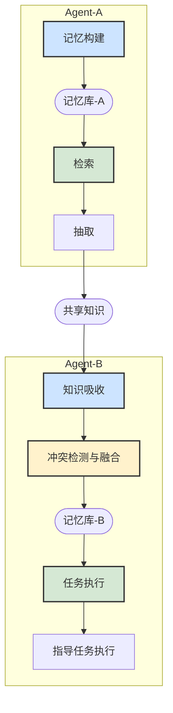

# MEK 协议规范
## Memory-Extraction-Knowledge Protocol

**版本**: 1.0
**日期**: 2025年9月

---

# 1 概览

MEK 协议（Memory-Extraction-Knowledge Protocol）是一套为高级智能体设计的、具备认知涌现能力的标准化记忆与知识管理框架。它通过定义 **M (Memory) 记忆核心** → **E (Extraction) 价值抽取** → **K (Knowledge) 知识提炼** 的核心逻辑链，旨在赋予智能体从个体经验中持续学习、在群体交互中实现成长的能力，最终构建一个能够自我演化的认知生态系统。

## 协议目标

MEK 协议致力于解决智能体认知架构中的三大核心挑战，这三大挑战亦是构建真正通用智能的基石：

- **Memory (记忆)**：如何高效、结构化地存储与组织多模态记忆信息？协议的目标是为智能体建立一个稳定、可扩展的长期知识经验库，使其所有经历都能成为未来决策的宝贵财富。
- **Extraction (抽取)**：如何根据动态变化的任务需求，精准、智能地从浩如烟海的记忆中提取高价值信息？协议旨在定义一套将原始记忆提炼为情景洞察的标准化流程。
- **Knowledge (知识)**：如何将个体智能体抽取的个性化信息，升华为可跨智能体复用、共享的通用知识？协议的核心使命在于打破智能体之间的认知壁垒，实现群体智能的协同演进。

协议的核心价值在于建立一套标准化的记忆处理与知识共享流程，使智能体能够将孤立的经验转化为系统化的认知能力，从而实现真正的智能涌现。

---

# 2 详细信息

## 2.1 基本协议

### 2.1.1 协议核心机制

MEK 协议的认知框架基于四种核心记忆机制与四种专门化记忆类型，共同构建了一个完整的记忆处理与升华体系。每一种机制都围绕 M-E-K 逻辑链精心设计，确保原始的、未经处理的记忆数据，能够被高效地转化为智能体的核心认知能力。

### 2.1.2 记忆存储机制

**Memory 层面的核心实现**

为了实现记忆的长期、高效管理，协议采用分类分层的结构化存储方案。每个记忆项均包含元数据与内容主体，以确保其可追溯性和关联性。

**记忆项结构 (`MemoryItem`)**

协议规定，所有记忆的基本原子单位都必须遵循 `MemoryItem` 结构。该结构通过丰富的元数据确保了每一份记忆的可追溯性、可解释性和关联性。
```
记忆项结构：
{
  "记忆标识": "唯一ID",
  "记忆类型": "画像/工作流/语义/情景",
  "时间戳": "创建时间",
  "内容主体": { ... }, // 详细结构取决于记忆类型
  "重要性等级": "高/中/低",
  "关联记忆": ["相关记忆ID列表"] // 该字段是构建智能体联想记忆网络的基石
}
```

**存储层次**：
三层存储架构旨在模拟生物记忆的工作方式，平衡响应速度与存储成本，确保智能体在不同场景下都能高效地调用所需记忆。
- **活跃记忆层 (Active Memory)**：存储当前任务最相关或最频繁访问的高优先级记忆，如同人类的“工作记忆”，保证即时响应。
- **长期记忆层 (Long-term Memory)**：稳定保存所有历史记忆，作为智能体经验的永久档案，是其“智慧”的根基。
- **压缩记忆层 (Compressed Memory)**：通过对长期记忆的提炼与泛化，存储最精华的知识摘要与模式，用于快速的直觉式推理与决策。

### 2.1.3 记忆生成机制

**从输入到 Memory 的转换过程**

记忆的生成是智能体认知世界的起点。协议规定，此过程必须遵循“感知→理解→存储”的三阶段流程，确保外部输入能够被高效、准确地内化为内部记忆。

1. **感知阶段 (Perception)**：通过标准化的多模态接口，统一接收文本、图像、音频、用户交互等各类信息输入。
2. **理解阶段 (Understanding)**：运用自然语言理解、实体识别、关系抽取等技术，深度解析输入内容，识别关键信息与上下文，形成结构化的中间表示。
3. **存储阶段 (Storage)**：根据内容的特性与元数据，将结构化后的信息分类存入对应的记忆类型，并完成与现有记忆网络的关联构建。

**记忆生成的指导原则**:
为保证记忆库的质量与效率，协议推荐在存储阶段遵循以下原则：
- **信息去重 (Deduplication)**：对重复或高度相似的信息进行合并与更新，而非简单冗余存储，这是维持认知系统简洁性的关键。
- **动态优先级 (Dynamic Prioritization)**：根据事件的重要性、新颖性或用户反馈，自动调整相关记忆的存储优先级。
- **关联构建 (Association Building)**：主动识别并建立不同记忆项之间的逻辑或时序连接，这是形成联想能力与创造力的基础。
- **冲突检测与融合 (Conflict Resolution)**：添加新记忆时，必须检测其与现有记忆的潜在冲突。MEK 协议的一个核心原则是：新信息应增强而非简单覆盖现有记忆。因此，协议推荐的解决策略是**融合 (Merge)**，例如合并工作流步骤、更新事实、补充关联记忆ID等，从而实现记忆的持续增强与自我完善。

### 2.1.3.1 冲突类型与融合策略 (推荐)

建议协议实现时对冲突进行分类，并采用相应的融合策略：

- **冲突类型**:
  - **冗余 (Redundancy)**: 新记忆与现有记忆的核心内容高度相似或重复。
  - **超集/子集 (Superset/Subset)**: 一个工作流是另一个的子流程或扩展流程（例如，“支付”与“扫码支付”）。
  - **矛盾 (Contradiction)**: 事实性记忆（画像、语义）之间存在逻辑矛盾（例如，用户偏好“红色” vs 用户讨厌“红色”）。

- **融合策略**:
  - **冗余冲突**: 推荐更新元数据（如增加引用计数、更新时间戳）而非重复存储。
  - **超集/子集冲突**: 推荐建立双向关联（`related_memory_ids`），并可选择性地将子集记忆融入超集记忆，丰富其细节。
  - **矛盾冲突**: 推荐保留双方记忆，并标记为“待解决”状态，或提升其重要性等级，交由更高阶的决策模块或人工介入。

### 2.1.4 记忆检索机制

**Extraction (E) 的第一阶段**

如果说记忆存储是构建经验宝库，那么记忆检索就是连接这座宝库与现实任务的桥梁。它构成了价值抽取（Extraction）流程的第一步：**粗选**。协议支持灵活多样的检索方式，以满足不同场景下的认知需求。

**检索类型**:
- **精确检索 (Exact Retrieval)**：基于关键词、ID 或特定属性进行准确查找，服务于目标明确的查询。
- **语义检索 (Semantic Retrieval)**：基于向量相似度，匹配含义相近的记忆内容，支持模糊和探索性的查询。
- **时序检索 (Temporal Retrieval)**：根据时间线索，回溯或预测事件相关的记忆序列，是构建因果链推理的基础。
- **关联检索 (Associative Retrieval)**：通过记忆项之间的连接关系，进行联想式、探索式查找，是创新与灵感的来源。

**抽取策略**:
- **相关性排序 (Relevance Ranking)**：必须优先返回与查询意图最相关的记忆项。
- **摘要式返回 (Summarized Return)**：协议鼓励根据需求提供记忆的摘要信息而非完整内容，以提升信息获取效率。
- **元数据标注 (Metadata Annotation)**：在返回结果中附带记忆的可信度、时效性等元数据，以辅助智能体进行更高级的决策。

### 2.1.5 价值抽取协议

**Extraction (E) 的核心阶段**

价值抽取是 MEK 协议的核心环节，是连接个体经验与通用知识的炼金炉。它负责将检索到的原始记忆（`MemoryItem`）提炼为标准化的、可共享的知识（`KnowledgeItem`）。此过程的抽象接口定义在 `KnowledgeService` 中，而具体的实现逻辑则由 `ExtractService` 承担，确保了价值抽取的规范性、一致性和安全性。

**抽取流程 (四步)**
该流程通常在 `share` 方法内部被调用，由 `ExtractService` 执行。每一步都是为了确保最终产出的知识是安全、通用且高价值的：
1.  **筛选 (`filter`)**: 从检索到的记忆列表中，筛选出具有普适价值的记忆内容。这是价值提炼的第一步，旨在确保认知资源被用于处理最有潜力的经验。
2.  **脱敏 (`desensitize`)**: 对筛选出的记忆进行严格的脱敏和清理，剥离所有个人身份信息、特定环境参数等私有细节。这是保障隐私和安全的基本要求。
3.  **泛化 (`generalize`)**: 进一步去除智能体特有的上下文信息，将个性化经验转化为普遍规律。这是知识能够被广泛复用的前提。
4.  **标准化 (`standardize`)**: 将清理后的信息封装为标准的 `KnowledgeItem` 格式，使其成为一个独立、完整、可跨平台理解的知识单元。

**知识服务接口定义 (`KnowledgeService`)**:
为了统一知识共享与吸收的交互模式，协议规定了 `KnowledgeService` 接口。
```python
class KnowledgeService(ABC):
    @abstractmethod
    def share(self, query: str, context: Optional[Dict[str, object]] = None) -> List[KnowledgeItem]:
        """
        根据查询从记忆中提取相关知识并进行标准化处理。
        此方法内部封装了完整的“检索->抽取->标准化”流程。
        """
        pass

    @abstractmethod
    def absorb(self, knowledge_items: List[KnowledgeItem]) -> List[str]:
        """
        将外部知识转换为本地记忆，包含冲突检测和解决。
        返回新生成或更新的记忆ID列表。
        """
        pass
```

## 2.2 知识共享机制

**Knowledge (K) 层面的核心实现**

知识共享机制是 MEK 协议实现群体智能、构建认知生态的核心。它利用价值抽取阶段产出的 `KnowledgeItem`，定义了一套完整的流程，描述知识如何在不同智能体之间安全、高效地传递、吸收和融合，最终实现 `1+1 > 2` 的认知协同效应。

### 2.2.1 可共享知识的结构定义 (`KnowledgeItem`)

为了确保知识在跨智能体、跨平台传递过程中的一致性与可解释性，所有共享的知识都必须被封装为标准的 `KnowledgeItem` 结构。
```
KnowledgeItem 结构:
{
  "knowledge_id": "知识的唯一标识",
  "title": "知识的简明标题",
  "content": { ... }, // 结构化知识，其模式与源记忆类型的content相关
  "source_memory_type": "该知识来源于何种记忆类型",
  "source_agent": "最初共享该知识的智能体标识", // 确保知识来源可追溯
  "created_at": "知识创建的时间戳",
  "metadata": "其他与知识相关的元数据" // 用于未来扩展
}
```

### 2.2.2 多代理知识共享流程图

下图以标准流程图的形式，展示了 MEK 协议中典型的多代理知识共享流程。该流程始于智能体 A 的个体记忆构建，经过知识的抽取与标准化，最终被智能体 B 吸收并用于指导新的任务执行，完美诠释了从个体经验到群体智慧的转化路径。



### 2.2.3 知识共享与吸收流程

**共享流程 (Sharing Process)**:
1. **检索 (Retrieve)**: 智能体A（共享方）根据共享目标或外部请求，通过 `MemoryService` 的 `retrieve` 方法检索相关记忆。
2. **抽取 (Extract)**: 调用 `KnowledgeService` 的 `share` 方法，该方法内部会委托 `ExtractService` 对检索到的记忆执行完整的价值抽取流程（筛选、脱敏、泛化、标准化），生成 `List[KnowledgeItem]`。

**吸收流程 (Absorption Process)**:
1. **感知 (Perceive)**: 智能体B（接收方）接收 `List[KnowledgeItem]`，并通过 `KnowledgeService` 的 `absorb` 方法启动吸收流程。
2. **理解与融合 (Understand & Fuse)**: 在 `absorb` 方法内部，`ExtractService` 首先将 `KnowledgeItem` 解析并转换为待存入的 `MemoryItem`。随后，`MemoryService` 会执行冲突检测，若存在冲突，则根据预设策略执行融合逻辑，实现新知识与旧经验的有机结合。
3. **存储 (Store)**: 将处理后的知识最终转化为一个新的 `MemoryItem`，存入自身的记忆库中，完成知识的内化。至此，外部知识已成为智能体B自身认知能力的一部分。

## 2.3 统一记忆服务接口

为确保协议在不同技术栈和应用场景下的实现一致性，并为上层服务提供一个稳定、可扩展的记忆管理核心，MEK协议强制定义了一个 `BaseMemoryService` 抽象基类。该接口是整个记忆系统的基石。

**统一接口定义 (`BaseMemoryService`)**:
```python
class BaseMemoryService(ABC):
    @abstractmethod
    def add(self, input_data: Union[str, Dict[str, Any]], **kwargs) -> List[str]:
        """
        添加新记忆的统一入口。
        此方法封装了“感知→理解→存储”的完整流程，包括冲突检测和知识融合。
        其 input_data 参数被设计为可处理多种数据源，例如原始业务数据、
        或其他智能体共享的 KnowledgeItem，从而统一“记忆生成”和“知识吸收”两个流程。
        
        Returns:
            新创建或已更新的记忆ID列表。
        """
        pass

    @abstractmethod
    def retrieve(self, query: str, retrieval_type: RetrievalType, options: RetrievalOptions) -> List[MemoryItem]:
        """
        根据查询条件从记忆库中检索相关记忆。
        """
        pass

    @abstractmethod
    def delete(self, memory_id: str) -> bool:
        """
        从记忆库中删除指定的记忆项。
        """
        pass

    @abstractmethod
    def update(self, memory_item: MemoryItem) -> str:
        """
        更新或添加记忆项。若ID已存在则更新，否则添加。
        返回被操作的记忆项ID。
        """
        pass
```

## 2.4 核心记忆类型

MEK协议支持多种专门化的记忆类型，以应对复杂世界的多样化信息。每种类型都应明确定义其 `content` 字段的数据模式，这是保证记忆结构化、可解析的基础。

### 2.4.1 工作流记忆 (Workflow Memory)

**功能**: 存储和管理智能体的程序性知识（procedural knowledge），即关于如何完成特定任务的过程性知识，如操作步骤、业务流程等。这是智能体“行动能力”的体现。

**`content` 结构定义**:
```json
{
  "task_description": "对任务的自然语言描述 (string)",
  "workflow_name": "工作流的规范化名称 (string)",
  "steps": [
    {
      "name": "步骤名称 (string)",
      "description": "步骤的详细描述 (string)",
      "details": { ... } // 包含参数等信息的字典 (dict)
    }
  ],
  "result_status": "执行结果状态 (string, e.g., 'success', 'failed')",
  "domain": "所属领域 (string, e.g., '通用', '购物')",
  "source_info": {
    "source_type": "来源类型 (string, e.g., 'trajectory', 'absorbed_knowledge')",
    "session_id": "原始会话ID (string, optional)",
    "source_agent": "来源智能体ID (string, optional)"
  }
}
```

### 2.4.2 画像记忆 (Profile Memory)

**功能**: 存储关于特定实体（如用户、其他智能体、系统）的描述性知识与关系性知识，形成认知画像。这是智能体发展出“社会能力”和“个性化服务能力”的基础。

**`content` 结构定义 (示例)**:
```json
{
  "entity_name": "实体名称 (string)",
  "entity_type": "实体类型 (string, e.g., 'user', 'system')",
  "attributes": {
    "preferences": ["偏好A", "偏好B"],
    "habits": ["习惯X", "习惯Y"]
  },
  "relations": [
    {
      "target_entity": "另一实体ID",
      "relation_type": "关系类型 (e.g., 'member_of')"
    }
  ]
}
```

> **对应的 KnowledgeItem.content 结构示例**:
> ```json
> {
>   "entity_type": "user",
>   "generalized_attributes": {
>     "preferences": ["偏好A"]
>   },
>   "source_domain": "购物"
> }
> ```

### 2.4.3 语义记忆 (Semantic Memory)

**功能**: 管理关于世界的事实、概念及其之间的关系，构建形式化的知识图谱。这是智能体理解世界、进行逻辑推理的“常识库”。

**`content` 结构定义 (示例)**:
```json
{
  "concept_name": "概念名称 (string)",
  "definition": "概念的定义 (string)",
  "properties": {
    "color": "红色",
    "shape": "圆形"
  },
  "relations": [
    {
      "target_concept": "另一概念",
      "relation_type": "is_a"
    }
  ]
}
```

> **对应的 KnowledgeItem.content 结构示例**:
> ```json
> {
>   "concept_name": "概念名称",
>   "generalized_properties": {
>     "shape": "圆形"
>   },
>   "domain": "物理"
> }
> ```

### 2.4.4 情景记忆 (Episode Memory)

**功能**: 记录带有丰富上下文的、发生在特定时空的具体事件和经历。情景记忆是自传式的，它构成了智能体的“个人史”，是进行反思、总结和学习的源泉。

**`content` 结构定义 (示例)**:
```json
{
  "event_summary": "事件摘要 (string)",
  "timestamp": "事件发生时间 (ISO 8601 string)",
  "location": "发生地点 (string)",
  "participants": ["参与者A", "参与者B"],
  "causal_chain": {
    "precedent": "前因事件ID",
    "consequence": "后果事件ID"
  },
  "learnings": "经验教训总结 (string)"
}
```

> **对应的 KnowledgeItem.content 结构示例**:
> ```json
> {
>   "event_pattern": "事件模式摘要 (string)",
>   "generalized_causal_chain": {
>     "precedent_pattern": "通用前因模式",
>     "consequence_pattern": "通用后果模式"
>   },
>   "generalized_learnings": "普适性经验教训 (string)",
>   "domain": "通用"
> }
> ```

# 3 附加能力

## 3.1 预置记忆

**描述**

预置记忆机制（或称记忆引导、冷启动）允许在智能体首次激活前，为其批量加载领域知识或基础能力。这对于快速部署特定领域的智能体至关重要。

### 3.1.1 记忆结构定义

预置记忆采用标准化的“记忆包”格式进行分发，以确保其可移植性和可复现性。

```
预置记忆包结构：
{
  "包标识": "记忆包唯一ID",
  "领域标签": "适用领域/场景",
  "内容列表": [
    {
      "memory_type": "画像/工作流/语义/情景",
      "content": { ... }, // 遵循对应记忆类型的content结构
      "importance": "高/中/低"
    }
  ]
}
```

### 3.1.2 加载流程

预置记忆的加载过程应遵循严格的流程，以确保其与智能体现有记忆体系的兼容性。
1. **验证 (Validation)**: 检查记忆包的完整性、版本兼容性及数字签名（如果需要）。
2. **解析 (Parsing)**: 解析记忆包内容并根据记忆类型建立内部索引。
3. **集成 (Integration)**: 将预置记忆逐条融入现有记忆体系。此过程强烈建议复用 `BaseMemoryService` 的 `add` 流程，以自动处理潜在的冲突。
4. **激活 (Activation)**: 根据初始任务或默认配置，将部分预置记忆提升至活跃记忆层，准备响应。

---

**MEK 协议规范结束**

*MEK 协议的核心在于赋予智能体管理记忆、提炼价值、升华知识的能力。它不仅仅是一个技术规范，更是构建能够从经验中持续学习、在协作中共同成长的下一代智能系统的基石。我们相信，遵循此协议将为创造出更强大、更鲁棒、更具智慧的智能体生态铺平道路。* 