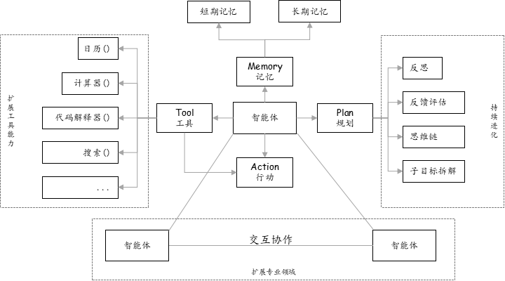
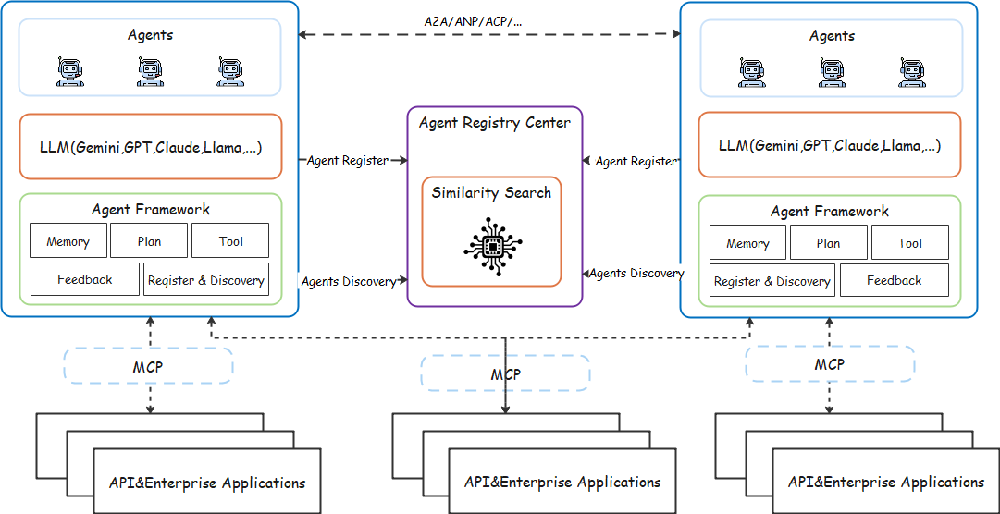
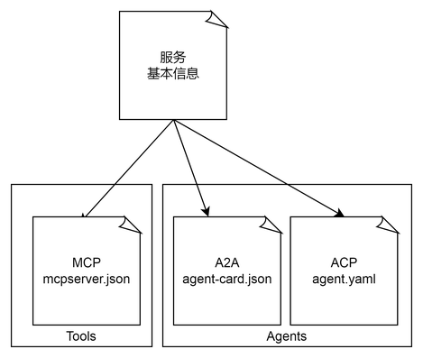
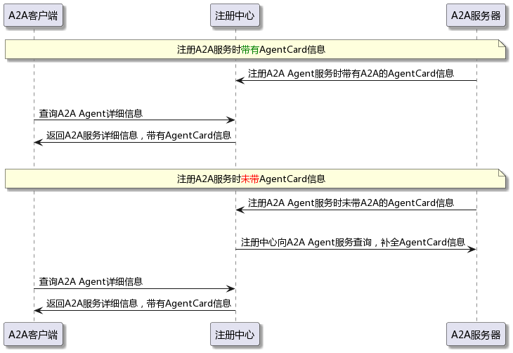
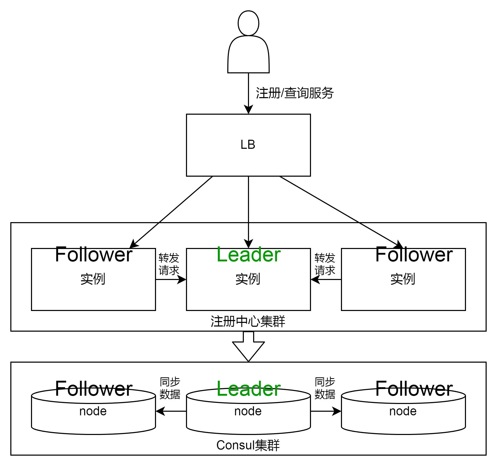
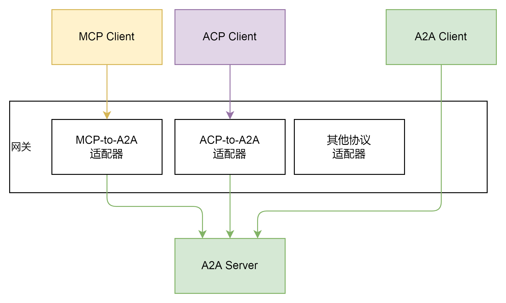
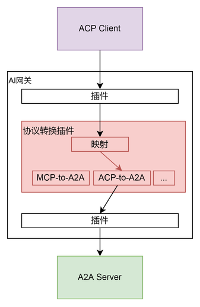

# 摘要

      在当今数字化时代，人工智能的飞速发展催生一种全新的技术实体---智能体。智能体作为具备自主感知、决策和执行能力的软件或硬件实体，正逐渐成为科技领域的焦点。从简单的任务自动化到复杂的决策支持，智能体的应用范围日益广泛。随着技术的不断进步，智能体的智能水平和功能也在不断提升，从基于规则的简单系统发展到能够自主学习和适应环境的复杂系统。这些智能体不仅能够独立完成任务，还能通过协作实现更复杂的目标，为我们的生活和工作带来前所未有的便利。

          然而随着智能体数量的增加和应用的普及，单一的智能体系统也逐渐显现出局限性。因此不同智能体之间的互操作性和协作能力成为打破智能体能力提升瓶颈的关键。智能体互通互联的诉求应运而生，旨在通过标准化的通信协议和接口，实现智能体之间的连接和高效协作。智能体互联网的重要性在于它能够打破智能体之间的孤岛，使它们能够在更广泛的网络中协同工作。这不仅提高了系统的整体效率，还能为用户提供更加个性化和智能化的服务。

 

# 1 引言

作为智能体互通互联核心基础，智能体通讯协议近期成为科研界和产业界的关注热点。继Anthropic公司提出用于连接大模型与工具之间的MCP后，Google公司提出了用于智能体之间通信的A2A协议。除此之外，中国的独立研究者常高伟在2024年6月也发布面向智能体网络的ANP，尽管这些智能体互联场景下的相关协议研究的出现，极大地推动智能体互联网的发展，但这些协议的在最初设计时都仅关注一个特定的场景，例如MCP重点考虑大模型如何调用工具，A2A的目标是解决企业间智能体互联的问题，虽然提出以智能体的能力发现，但智能体注册中的发现没有工具落地。ANP保证智能体之间的自由互联空间，没有对智能体的可管理性进行太多设计。

| 协议   | 设计目标                | 核心特性                     | 架构模式            | 关键技术               | 适用场景                     | 社区生态                     |
|--------|-------------------------|------------------------------|---------------------|------------------------|------------------------------|------------------------------|
| MCP    | 大模型工具接口标准化    | 简单易用，能力协商 能力协商机制 本地双向通讯(HTTP+SSE) | 客户端-服务器       | JSON-RPC2.0框架        | AI工具集成、本地资源操作 企业知识库问答 IDE编程助手 办公助手     | Anthropic推动，活跃 Claude、Zed等集成案例 |
| ANP    | 去中心化智能体网络      | 安全性高，支持自动协商 元协议动态性协商 语义网数据交换 | 分层P2P            | W3C DID身份认证        | 跨平台协作、物联网设备 跨平台个人助手协作 物联网社保自治网络 安全敏感场景     | 开源社区驱动，多语言 国内团队开源先行 技术前瞻性强、支持动态修复 |
| Agora  | LLM驱动自适应通讯       | 灵活高效，协议动态适配 LLM生成通讯代码 分层协议协商 | P2P去中心化         | 协议文档(PD)机制       | 多Agent协作、分布式AI 多智能体研究试验 未知环境自组织协作 AGI前瞻探索     | Oxford推动，实验验证 牛津大学学术成果 改进验证阶段，生态以论文讨论为主 |
| Agent.json | 简化通信标准化       | 轻量易用，标准化消息格式 身份认证集成 自动化服务发现 | 去中心化代理        | HTTP端点描述           | 基础通信、微服务交互 网站AI代理接口 企业内部API目录     | 早期发展阶段 轻量易部署，兼容现有WEB 草案阶段，潜在标配协议 |
| LMOS   | 多智能体集群管控平台    | 全栈整合，多智能体集群管理 mDNS服务发现 集群化负载均衡 | 星型集群+总线       | Agent描述格式标准化    | 企业级资源调度 跨驱动自动化工作流 异构Agent统一调度 企业级客服     | 早期发展，需关注更新 Eclipse基金会孵化 整合LangChain等框架，企业级扩展性强 |
| AITP   | 安全交互与交易协议      | 安全交互，区块链交易 支付/核心模块 跨链身份验证 | 中心化会话中转      | 结构化对象线程         | 智能体商业应用 跨组织Agent交易 供应链自动化协商     | NEAR基金推动 集成区块链生态 |
| A2A    | 企业级智能体的社交协议  | 远程发现，异步协作通讯 任务管理 消息传递 信息协商 | 中心化协调+任务管理 | Agent卡注册            | 企业级智能体协同 跨系统流程自动化 供应链管理优化 医疗健康     | 谷歌牵头，新发布需关注 首批50+企业加入，包括Salesforce、Atlassian、SAP等，商业潜力显著 |
| ACP    | 聚焦本地/边缘多智能体协作 | 通信机制灵活，低延迟 事件驱动、能力声明、语义描述、自动路由 | 去中心化架构        | 支持RESTful HTTP、gRPC、本地总线等 | 适合边缘、IoT、机器人等场景边缘计算 隐私敏感、网络受限或离线部署需求 | Linux 基金会与 BeeAI共同开发的开放标准 IBM Research与 BeeAI 社区推动   

未来随智能体的发展，智能体的自主地发现、沟通和协作，无需人工干预可能是趋势。虽然MCP和A2A这样的协议有效地促进智能体与外部工具之间以及智能体之间的通信和协作，但智能体间的协作仍然需要大量的工作要做，具体的挑战如下：

- 注册发现的发现挑战
  
智能体需要调用外部工具或第三方智能体服务时，由于行业尚未建立统一的服务注册与发现标准，各厂商在服务命名规范、接口定义及管理机制上存在显著差异。这种异构化服务生态导致开发者被迫承担繁重的手动维护工作，需为每个工具/服务建立专属适配层。

在系统层面，智能体无法通过自主发现机制动态识别可用服务，限制跨平台能力的灵活调用；在生态层面，碎片化的服务管理体系严重制约多智能体系统的协同效能，阻碍了构建开放型AI服务生态的进程。这种现状不仅增加了系统集成成本，更成为制约AI智能体向自主化、规模化方向演进的关键桎梏。

- 互操作性挑战

多智能体系统生态中，协议异构性已成为制约技术融合的关键瓶颈。当前产业界呈现显著的技术路线分化，头部厂商分别采用MCP、A2A、ANP等差异化通信协议，形成技术壁垒。这种碎片化发展态势随着AI应用场景拓展持续加剧，预计未来将涌现更多私有化协议变体。智能体无法自主识别和适应这些差异，意味着仍然需要手动配置和管理。在处理各种协议方面缺乏灵活性，限制跨平台的代理间以及代理与工具之间的无缝通信。

- 安全及身份验证挑战：

在多智能体系统与工具服务生态中，身份认证安全与计费协同问题已演变为制约跨厂商协作的核心技术桎梏，导致系统集成成本呈指数级增长。

本协议要为突破单智能体能力限制，以开放互联的形式构建智能体之间可以实现平等互通、互联协作，使智能体之间可自组织、自协商形成一个高效协作网络，实现根据用户任务需求动态协作。旨在通过标准化的通信协议和接口，实现智能体之间的无缝连接和高效协作。智能体互联网的重要性在于，它能够打破智能体之间的孤岛，使它们能够在更广泛的网络中可协同工作。

本协议档主要提出以下解决方案：
1. 智能体注册发现机制：设计统一描述的注册发现协议，涵盖身份标识、能力声明、服务接口等核心元数据规范。支持自动或手动注册，并提供生命周期管理功能。
2. 智能体间通讯协议：定义基于RESTful或gRPC标准化的API通讯协议规范以降低集成成本。同时考虑异构厂商协议的不同特性，借助网关实现智能体之间的自适应通信。
3. 安全认证及授权：通过OAuth2.0、零信任架构等技术实现智能体间的双向身份验证和最小权限访问控制。
4. 快速开发SDK：提供从原型到生产的加速引擎，并通过SDK封装降低研发成本。最后，在演进计划中列出具体的时间表，并提供了各产品的落地情况表以供参考。

## 1.1 术语描述
| 编号   | 缩略语或符号   | 全拼或名称                             | 说明                                                                                                  |
|:-----|:---------|:----------------------------------|:----------------------------------------------------------------------------------------------------|
| 1    | API      | Application Programming Interface | 应用程序编程接口，用于不同软件组件或系统之间的交互和数据交换。充当不同应用程序之间的桥梁，允许开发者无需了解底层实现细节即可调用功能或获取数据。                            |
| 2    | A2A      | Agent2Agent                       | Agent-to-Agent，A2A是一个开放的标准，旨在实现AI agent之间的无缝通信和协作，在使用不同框架和不同供应商构建智能体的世界中，A2A提供一种通用语言，打破了竖井并促进了互操作性。 |
| 3    | ANP      | Agent Network Protocol            | ANP借鉴HTTP协议的发展路径，采用中心化身份体系(DID)构建智能体网络底层，实现高度自治和安全的智能体通信。                                           |
| 4    | MCP      | Model Context Protocol            | MCP是一种专为智能体架构设计的通用工具能力注册、调用与管理协议                                                                    |
| 5    | HTTP     | HyperText Transfer Protocol       | 超文本传输协议，用于客户端浏览器与服务器之间的数据传输                                                                         |
| 6    | SSE      | Server-Sent Events                | SSE基于HTTP协议的服务器到客户端的实时通信技术，适用于需要服务器主动推送数据的                                                          |
| 7    | SLA      | Service Level Agreement           | 服务等级协议，服务提供商与客户之间签订的正式协议，用于明确服务质量标准、性能指标及违约责任，是保障服务可靠性和业务连续性的核心定义                                   |
| 8    | JWT      | JSON Web Token                    | 认证令牌标准，基于JSON的开放标准，用于在网络应用间安全传输声明信息，应用于身份验证和授权场景                                                    |
| 9    | JSON     | JavaScript Object Notation        | JSON是一种轻量级的数据交换格式，基于 JavaScript 对象语法设计，采用文本格式存储和传输数据。它独立于编程语言，支持跨平台数据交换，广泛应用于Web开发、API通信等领域。        |
| 10   | JSON-RPC | JSON Remote Procedure Call        | 基于JSON格式的轻量级远程过程调用RPC协议，其主要特点是轻量，跨语言/平台，传输协议无关性，可基于HTTP、WebSocket、TCP等多种底层协议传输                      |

# 2 统一协议

统一智能体注册发现机制，即智能体在启动时注册自己的能力位置等信息，其它智能体按需检索和对接，是实现智能体高效协作与资源合理利用的关键支撑，其核心作用在于精准定位所需智能体资源，保障系统内各智能体顺畅交互，从而推动复杂任务的协同完成。统一协议旨在统一应用生命周期管理流程，提供通用注册机制，增强信任并通过通用发现方案促进跨协议的安全交互；同时给出形式化协议规范，提升清晰度与可实现性。强调异构协议的统一注册、异构智能体的统一发现机制、异构协议的通过网关的协议互转，降低异构协议对智能体应用的影响。

- 统一智能体注册发现机制：智能体启动时注册能力位置等信息，供其他智能体检索对接，能精准定位资源、保障交互，推动协同完成任务。
- 统一异构智能体动态组网核心技术：涵盖跨协议互操作等方面，多协议适配与转换通过跨界网关实现异构协议间无缝数据交换和资源共享。
- 统一协议：统一应用生命周期管理流程，提供通用机制促进安全交互并给出形式化规范，强调统一注册、发现及协议互转，降低异构协议影响，目的在于生态融合、安全增强、开发降本。

统一协议的其主要目的如下：
- 生态融合：解决多协议并存导致的智能体协作效率低下问题，构建跨平台、跨厂商的互联互通基础
- 安全增强：通过统一信任机制和形式化验证，降低跨协议交互的安全风险
-  开发降本：提供标准化开发范式，减少开发者对异构协议的适配成本

# 3 系统架构

智能体系统是一个由多种智能体和工具组成的网络，这些组件可能采用不同的通信协议（如A2A、ACP、MCP等）和传输协议（HTTP、gRPC等）。

系统通过两种方式支持各种协议的客户端和服务器之间的通信：
1. 直接通信：当协议兼容时，可直接建立连接并交换数据
2. 网关中转：当协议不匹配时，由网关进行协议转换和适配

系统通信流程的阶段：

1. 服务注册阶段，智能体注册到注册中心
2. 服务发现阶段，智能体通过注册中心查询目标服务的协议类型和地址
3. 协议协商阶段，双方确定通信方式（直接或网关中转) 网关在此过程中承担协议转换、流量管理和安全防护三重角色，确保不同协议间的无缝对接。
4. 数据交换阶段，按照协商的协议规范传输信息

该系统的核心价值在于解决了异构智能体间的通信难题，其设计特点包括：支持不同协议的服务发现机制，支持统一注册和查询；协议转换能力，通过网关实现不同协议栈的互操作这种设计既保持了各智能体的协议独立性，又实现了系统整体的协同工作能力。 

## 3.1 对象

### 3.1.1 服务
‌定义‌：注册的端点对象，提供可被调用的功能实体。

‌功能定位‌：
- ‌协议支持‌：支持A2A、MCP、ACP等智能体协议，兼容HTTP/gRPC等传输协议
- ‌元数据管理‌：声明基础信息（IP、端口、协议版本）及协议扩展数据（如A2A的Agent Card）
- ‌服务暴露‌：通过注册中心发布自身能力，供客户端发现与调用。

### 3.1.2 客户端
‌定义‌：服务消费者，负责查询和调用服务。
‌功能定位‌：
- ‌‌服务发现‌：通过注册中心按协议类型、标签等条件查询服务地址及能力。
- ‌‌动态调用‌：根据服务协议规范发起请求，支持直接查询或通过注册中心间接获取能力信息。

### 3.1.3 注册者
‌定义‌：服务自身或第三方注册代理，负责与服务注册中心交互。
‌功能定位‌：
- ‌‌‌多模式注册‌：
  - ‌‌‌自注册‌：临时服务通过SDK直接注册。
  - ‌‌‌代注册‌：持久服务由第三方代理完成注册。
- ‌‌‌全流程支持‌：封装服务发现、健康检查、能力声明等操作，降低服务接入复杂度。

### 3.1.4 注册中心
‌定义‌：服务治理核心组件，维护服务全生命周期状态。
‌功能定位‌：
- ‌‌‌‌服务管理‌：处理注册/注销请求，维护服务元数据（含协议扩展字段）
- ‌‌‌‌数据分层存储‌：
  - ‌‌‌缓存层‌：内存数据库实现快速响应。
  - ‌‌‌持久层‌：分布式KV存储保障数据强一致性。
- ‌‌‌‌健康监控‌：定期检测服务可用性，剔除异常实例。

### 3.1.5 网关
‌定义‌：网络流量入口，负责协议转换与流量管理。
‌功能定位‌：
- ‌‌‌‌‌协议转换‌：适配客户端与服务间的协议差异（如MCP转A2A）
- ‌‌‌‌‌流量管理‌：实现负载均衡、路由转发及安全防护
- ‌‌‌‌‌请求转发‌：统一处理外部请求，屏蔽后端服务细节

### 3‌.2 对象关系
- ‌‌‌‌‌‌服务‌与‌注册中心‌：通过注册者完成元数据发布与状态同步
- ‌‌‌‌‌‌客户端‌依赖‌注册中心‌发现目标服务，然后与服务通信
- ‌‌‌‌‌‌注册者‌作为中间层，抽象服务注册细节
- ‌‌‌‌‌‌注册中心‌作为中枢，统一管理服务信息与健康状态
- ‌‌‌‌‌‌网关‌作为流量入口，屏蔽协议差异，保障通信安全与效率

# 4 注册中心

## 4.1 设计原则
- 协议统一抽象：所有协议均映射为统一服务模型
- 协议特定扩展：协议特有数据映射为专有字段
- 数据一致性：分布式AP模型保障高可用

## 4.2 统一服务模型
不同Agent/Tool协议服务的关系
- 相同的基本信息，例如服务名、服务地址、服务协议等
- 各协议特有的配置，例如A2A服务的AgentCard信息
- 服务之间使用协议规定的交互模式，例如同步/异步/流式等
- 搜索增强，例如模糊匹配、语义查询/路由等

各种协议的服务的统一对象模型：服务的通用信息，再加上各协议类型、对应的协议特有配置信息

### 4.2.1 服务类型

#### 4.2.1.1 临时服务
- 采用服务主动上报自身状态，服务注册以后需要周期性的更新续期，超时未续期则会被注册中心删除
- 服务信息仅存储在内存中，不持久化到磁盘
- 适用于自注册服务

#### 4.2.1.2 持久服务
- 采用注册中心主动周期性的检测服务状态，失败后标记为不健康但不会自动删除‌
- 实例信息同时持久化，需手动删除才能彻底移除‌
- 适用于第三方注册服务

### 4.2.2 服务生命周期

#### 4.2.2.1 临时服务生命周期
1. 初始注册：
- 提交数据：服务名、端点地址、协议类型等
- 初始TTL设置（默认60秒）

2. 续期机制：
- 提交数据：服务ID
- 更新间隔：（默认15秒）
- 失效机制：超过续期时间，服务设置为不健康
- 删除机制：超过删除时间，服务自动删除

3. 异常处理：
- 注册者宕机：自动触发恢复注册
- TTL过期：自动删除

#### 4.2.2.2 持久服务生命周期
1. 持久化注册：
- 持久保存
- 配置健康检查策略
2. 健康检查机制：
- 注册中心检查
- 服务响应检查
- 根据服务响应，设置服务健康状态
3. 故障处理流程：
- 服务长期异常或宕机：注册中心将服务设置为不健康状态
- 服务恢复：注册中心将服务恢复为健康状态

### 4.2.3 注册中心获取服务能力信息
不同协议类型的服务带有不同的服务能力信息
- A2A：Agent Card信息
- ACP：Agent Manifest信息
- MCP：MCP Server信息

不同的服务类型的服务能力的获取方式如下。

#### 4.2.3.1 服务注册时带有服务能力信息

通常是自注册的服务，在注册时，在服务对象中带有服务能力信息

#### 4.2.3.2 服务注册时未带有服务能力信息

通常是非自注册的服务，由第三方代为注册，在注册时，服务对象中可能没有服务能力信息

需要在注册以后，由注册中心向服务查询服务能力信息，补充到服务对象中

以A2A服务为例，流程如下图

### 4.2.3 注册中心管理服务路由

本系统采用注册中心组件管理服务路由的方案（在其他系统中可能采用非注册中心组件来管理服务路由）

网关根据服务路由转发请求的流程：
1. 在注册中心配置服务和服务路由
2. 网关配置注册中心作为服务和服务路由的数据源
3. 网关收到请求后，根据服务路由将请求转发给服务

## 4.3 高可用
注册中心可以选用各种数据库来存储数据，注册中心的功能和接口不变，下文以Consul为例。
- 数据的一致性和高可用通过后端数据库(Consul)来实现
  - 多个节点组成集群
  - Raft算法选举leader，负责数据同步与协调
  - 现有Leader故障时，集群重新选举Leader
  - 注册中心通过Leader写入数据
- 注册中心避免单点故障
  - 注册中心部署多个实例
  - Raft算法选举Leader，负责数据读写，具体方法：基于Consul的会话机制来实现分布式锁，所有注册中心实例都用自己的会话去获取分布式锁，唯一拥有锁的就是Leader
  - 调用注册中心接口时通过前置LB转发；无LB时，则由调用者自行处理，配置所有实例的地址，在访问某实例地址出错时重试其他实例
- 健康检查
  - 由注册中心的Leader执行健康检查

# 4 网关

## 4.1 设计原则
网关遵循以下原则，这些原则保障了系统的灵活性和可靠性。
- 协议无关性原则，确保架构不绑定特定协议标准
- 语义一致性原则，转换过程保持原始意图
- 最小干预原则，仅必要时进行协议转换

具体实现上，网关采用"适配器模式"处理协议差异，为每对协议组合创建专用适配器。适配器包含语义映射表和转换规则库，前者定义概念对应关系，后者实现具体转换逻辑。这种设计使得新协议支持仅需添加新的适配器模块，无需修改核心系统。

## 4.2 协议转换
客户端/服务器可能存在各种协议差异：
- 协议类型不同，如A2A、ACP、MCP
- 同一协议版本不同，不同版本不完全兼容
- 统一协议传输协议不同，如传输协议（HTTP、gRPC等）

通过网关做统一适配转换，可以消除这些差异，实现智能体系统不同应用的互联

### 4.2.1 适配机制
协议转换采用双向适配器模式，为每对协议组合创建专用适配器。适配器包含语义映射表和转换规则库，前者定义概念对应关系，后者实现具体转换逻辑。例如A2A到MCP的适配器会处理事件驱动与上下文传递的语义差异。

适配器实现遵循"输入解析-语义转换-输出生成"的三步流程。输入解析阶段将原始消息转换为内部表示；语义转换阶段应用映射规则转换内部表示；输出生成阶段将结果序列化为目标协议格式。这种分层设计使得转换逻辑清晰且易于维护。

路由查询阶段根据请求参数，选择匹配路由。协议识别阶段分析消息头部特征和内容模式，准确识别输入协议类型。转换执行阶段应用语义映射规则，确保转换后的消息保持原始意图。响应封装阶段将结果转换为客户端期望的协议格式。

网关对功能交集可以通过各种适配器去做转换，把某种协议的服务发布为其他协议的服务

以上图中ACP Client访问A2A Server为例，说明网关如何做协议转换
- 网关通过插件链处理请求
- 协议转换插件执行转换
  - 插件拥有多种协议适配器
  - 收到请求后，根据路由协议和服务协议，查找对应的适配器（例如收到请求后，对应Route里的agent_protocol是ACP，对应Service的agent_protocol是A2A，则查找ACP-to-A2A的适配器）
    - 如找到适配器，继续下一步
    - 如未找到适配器，返回错误
- 将请求转给适配器，执行转换
  - 如果转换成功，继续转发给下一个插件
  - 如果转换失败，返回错
- 将来A2A Server响应返回时，适配器执行相反的转换

### 4.2.2 插件处理流程
- 接收请求阶段‌
  - 网关监听指定端口，接收来自客户端的网络请求
  - 对请求进行初步验证，包括协议头检查、基本格式校验等
- ‌路由查找阶段‌
  - 解析请求内容提取关键路由标识（如URL路径、消息头字段等）
  - 查询路由表匹配目标服务端点
- ‌服务匹配阶段‌
  - 根据路由结果定位具体服务实例
  - 获取服务元数据，包括支持的协议类型、版本号、QoS参数等
  - 检查服务可用性（健康状态、负载情况等）
- ‌协议处理决策‌
  - 比较客户端协议与服务端协议的一致性
  - ‌协议一致时‌：直接建立透传通道，优化性能
  - ‌协议不一致时‌：触发协议转换流程
    - 解构源协议消息，提取业务数据和元信息
    - 按照预定义的映射规则进行协议元素转换
    - 重构为目标协议格式的消息
- ‌请求转发阶段‌
  - 建立与服务端的连接（可能复用现有连接）
  - 发送转换后的请求（或原始请求）
  - 设置适当的超时和重试机制
- ‌响应处理阶段‌
  - 接收服务端响应
  - 如需协议转换，执行逆向转换过程
  - 将最终响应返回给客户端

### 4.2.3 MCP转A2A/MCP
网关将Agent服务（A2A/ACP）映射为MCP服务方法：
- 配置Agent服务的路由的协议参数为MCP
- 网关将Agent服务封装为MCP服务
  - Agent信息封装为resource
  - Agent执行任务的接口封装为Tool
- 网关做路由时，将MCP接口调用映射为Agent接口，如下表

<table>
    <tr>
        <td>MCP对象</td>
        <td colspan="2">MCP接口</td>
        <td>说明</td>
        <td rowspan="8">接口映射为-&gt;</td>
        <td>对应A2A接口</td>
        <td>对应ACP接口</td>
    </tr>
    <tr>
        <td rowspan="2">Resource</td>
        <td colspan="2">resource/list</td>
        <td>返回Agent基本信息</td>
        <td colspan="2" rowspan="2">无，网关从注册中心获取相关信息</td>
    </tr>
    <tr>
        <td colspan="2">resource/read</td>
        <td>返回Agent能力信息</td>
    </tr>
    <tr>
        <td>Tool</td>
        <td colspan="2">tool/list</td>
        <td>返回tool列表（见下方）</td>
        <td colspan="2">-</td>
    </tr>
    <tr>
        <td></td>
        <td>tool/call</td>
        <td>list_agents</td>
        <td>返回所有Agent能力信息（AgentCard/AgentManifest）</td>
        <td>GET /.well-known/agent-card.json</td>
        <td>GET /agents</td>
    </tr>
    <tr>
        <td></td>
        <td></td>
        <td>run_agent_task</td>
        <td>指定agent启动新任务</td>
        <td>POST /message/send</td>
        <td>POST /runs</td>
    </tr>
    <tr>
        <td></td>
        <td></td>
        <td>cancel_agent_task</td>
        <td>指定agent启动新任务</td>
        <td rowspan="2">不支持，直接返回错误</td>
        <td>POST /runs/{run_id}/cancel</td>
    </tr>
    <tr>
        <td></td>
        <td></td>
        <td>resume_agent_task</td>
        <td>指定agent恢复暂停的任务</td>
        <td>POST /runs/{run_id}</td>
    </tr>
</table>

# 5  定义

## 5.1 对象定义

### 5.1.1 服务(Service)对象

参见附录的schema的Service对象

### 5.1.2 健康检查参数

#### 5.1.2.1 临时注册类型的服务的健康检查配置(ephemeral_check)

参见附录的schema的EphemeralCheck对象

#### 5.1.2.2 持久注册类型的服务的健康检查配置(persistent_check)

参见附录的schema的PersistentCheck对象

### 5.1.3 特定协议的内容

当Service的agent_protocol值为不同Agent协议时，对应的agent_info的内容为此Agent协议的特定内容，如下:

| agent_protocol | agent_info          |
|----------------|-------------------------|
| a2a   | AgentCard对象，详见：https://a2a-protocol.org/latest/specification/#55-agentcard-object-structure   <pre>{     "agent_info": {         "a2a_agent_card": {             "protocolVersion": "0.2.9",              "name": "GeoSpatial Route Planner Agent",              "description": "...",              "url": "https://georoute-agent.example.com/a2a/v1",              "skills": [                 {                     "id": "route-optimizer-traffic",                      "name": "Traffic-Aware Route Optimizer",                      "description": "..."                 }             ]         }     } } url: https://georoute-agent.example.com/a2a/v1
</pre> |
| acp   | AgentManifest对象，详见：https://agentcommunicationprotocol.dev/core-concepts/agent-manifest   <pre>{     "agent_info": {         "acp_agent_manifest": {             "name": "chat",              "description": "...",              "metadata": {                 "capabilities": [                     {                         "name": "Conversational AI",                          "description": "Handles multi-turn conversations with memory."                     },                      {                         "name": "Vacation Request",                          "description": "Handles submission and tracking of vacation requests."                     }                 ]             }         }     } }
</pre> |

### 5.1.2 服务路由（Route）对象

### 5.1.3 请求响应对象

#### 5.1.3.1 注册服务请求

#### 5.1.3.2 注册服务响应

#### 5.1.3.3 服务响应对象

#### 5.1.3.4 注册路由对象

#### 5.1.3.5 更新路由对象

#### 5.1.3.6 路由响应对象

## 5.2 接口定义

### 5.2.1 服务接口
- 注册
  - POST /services
  - 请求body：CreateServiceRequest
  - 响应body：ServiceResponse
- 更新
  - PATCH /services/{id}
  - 请求body：UpdateServiceRequest
  - 响应body：ServiceResponse
- 续期
  - PUT /services/{id}/renewal
  - 请求body：无
  - 响应body：无
- 删除
  - DELETE /services/{id}
  - 请求body：无
  - 响应body：无
- 查询所有
  - GET /services?wait={wait}&index={index}
  - 请求body：无
  - 请求query：wait，index
  - 响应body：ServiceResponse列表
  - 阻塞查询使用说明：wait和index是可选参数，用于阻塞查询
- 按名称查询
  - GET /services/{servicename}
  - 请求body：无
  - 响应body：ServiceResponse列表

### 5.2.2 服务路由接口
- 创建
  - POST /routes
  - 请求body：CreateRouteRequest
  - 响应body：RouteResponse
- 更新 
  - PATCH /routes/{routename}
  - 请求body：UpdateRouteRequest
  - 响应body：RouteResponse
- 删除 
  - DELETE  /routes/{routename}
  - 请求body：无
  - 响应body：无
- 监听所有路由更新 
  - GET /routes?wait={wait}&index={index}
  - 请求body：无
  - 响应body：RouteResponse列表
  - 阻塞查询使用说明：wait和index是可选参数，用于阻塞查询
- 按名称查询
  - GET /routes/{routename}
  - 请求body：无
  - 响应body：RouteResponse

## 5.3 协议扩展机制
为支持新协议，需要针对此协议做以下增强工作。

注册中心支持：
- 协议类型
- 协议特定扩展字段
- 获取协议能力

网关支持:
- 发布协议能力
- 协议转换

# 6 安全增强
产品落地时需要再应用层考虑通过OAuth2.0、零信任架构等技术实现智能体间的双向身份验证，确保通信数据的加密传输和最小权限访问控制，防止恶意节点注入和仿冒攻击，保障跨域协作可审计性。
- 身份标识体系：无论是智能体还是人类用户，其规范身份均由 did:web 标识符定义。此标识符具有全局唯一性、可解析性和人类可读性，通过智能体身份标识的全局唯一性绑定，确保每个智能体的可追溯性。
- 双向身份验证：采用基于数字证书或OAuth 2.0的双向认证机制，确保智能体在通信前互相验证身份，防止恶意节点伪装接入。
- 接入认证：智能体之间的所有接入认证，都必须通过 mTLS 实现。客户端智能体出示其包含自身 DID 的证书。服务端智能体通过解析该 DID 并获取其 DID 文档，来验证证书公钥的合法性，从而完成点对点的智能体身份认证。
- 传输加密:  TLS 1.3。所有 A2A通信都必须在 mTLS 建立的安全认证信道之上进行。
- 多因素认证：基于属性基于访问控制，为智能体分配细粒度权限。根据用户身份和权限，对通信数据进行访问控制，确保只有授权用户才能访问敏感信息。
- 会话级鉴权/授权：根据场景任务动态生成最小权限令牌（如仅开放当前任务所需API），协同配合固定角色授权。

# 7 其他增强
- 通信效率提升：通过引入二进制编码（如Protocol Buffers或FlatBuffers）替代传统JSON/XML，减少数据传输体积，降低序列化/反序列化开销，其次针对特定业务在对传输数据做压缩，或通过共享数据服务传递地址而非原始数据。
- 语义互操作性：采用JSON或Protocol Buffers等轻量级数据格式，兼顾可读性与传输效率，同时定义统一的数据字段规范（如时间戳格式、字段命名规则）以减少解析冲突。明确定义接口的语义约束，避免智能体间的歧义性交互。
- 共享数据：多智能体按任务执行的结果，通过数据共享，降低网络消耗及大模型解析的资源消耗。将频繁使用的上下文信息（如任务目标、历史交互）缓存在分布式存储中(文件服务器)，确保多个智能体可高效访问。增量更新仅在上下文发生变化时进行更新和同步，避免每次交互都重新生成完整上下文。

# 8 未来工作
- 打分与评估：基于原型验证延迟/吞吐/可扩展性。
- 性能基准：解析/注册在多模型与负载下的系统化压测。
- 高级密码学：能力选择性披露ZKP、更先进的 PIR。
- 形式化验证：对注册/解析/身份管理协议进行形式化建模与证明。
- 治理：完善命名策略、CA/RA 运营要求、争议仲裁、信任框架演进。
- 平台集成：与 LangChain、AutoGen、CrewAI 等及主流云平台适配。
- 语义互操作：基于注册元数据的能力本体/翻译网关研究。
- 声誉系统：在档案中引入信誉/背书/证明。
- 能力协商与绑定协议：解析后协商能力、SLO、合同化绑定。
- 治理白皮书：名称分配、收费、仲裁、根CA托管。

# 9 收益
- 价值：在多协议生态中提供统一、安全的发现与初始信任；对金融/医疗/安全等敏感领域尤为关键；降低开发门槛、推动创新；支持复杂自治系统与安全市场。
- 方向：通过插件化适配层持续承载新协议；治理、全球扩展与深层语义互操作仍需演进，但UAP是通往可扩展、可信代理生态的重要一步。

# 10 参考文献
- A2A规范： https://a2a-protocol.org/latest/specification
- ACP规范：https://agentcommunicationprotocol.dev/introduction/welcome
- MCP规范：https://modelcontextprotocol.io/specification

# 附录 A
- 协议对象schema文件：https://github.com/ZTE-AICloud/Co-TAP/docs/specification/UAP/uap-schema.json